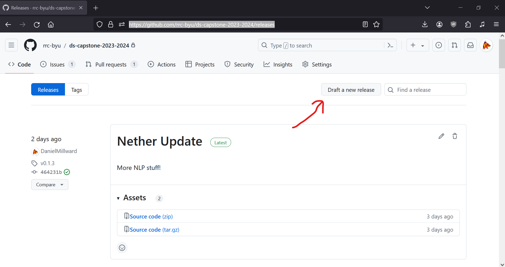
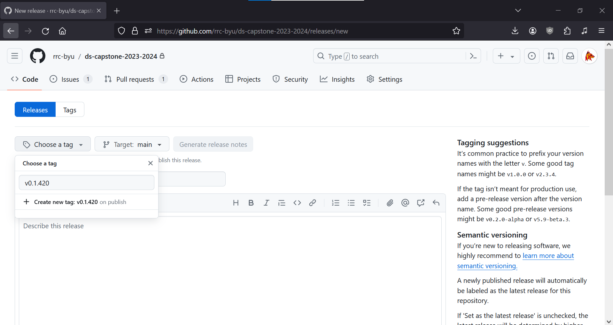

Maintenance
===================================

Making a New Release
------------------

If you've merged some new updates to the main branch, you'll want to release it to PyPi. To do that, go to https://github.com/rrc-byu/ds-capstone-2023-2024/releases 
and click "Draft a new release."

Next, click "Choose a tag" and write the new version. To maintain consistency, make one in the format v1.x.x

Then scroll down and select "Publish Release." That's it! Now, the `python-publish.yml <https://github.com/rrc-byu/ds-capstone-2023-2024/blob/main/.github/workflows/python-publish.yml>`_
GitHub action will run, automatically creating a new PyPi release with the version number you set.